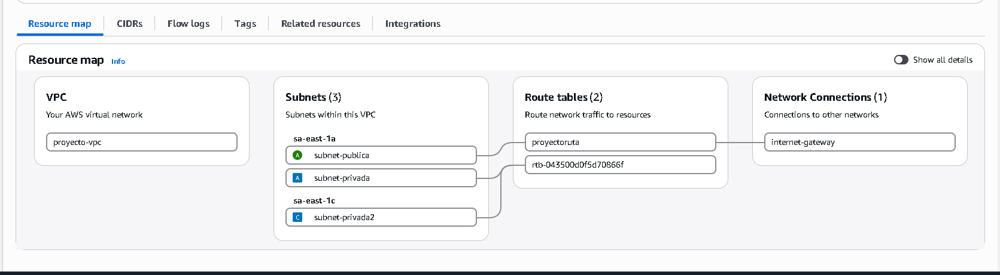
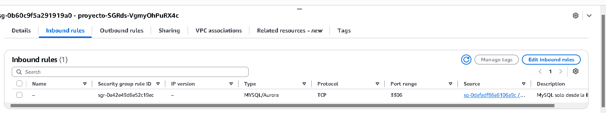
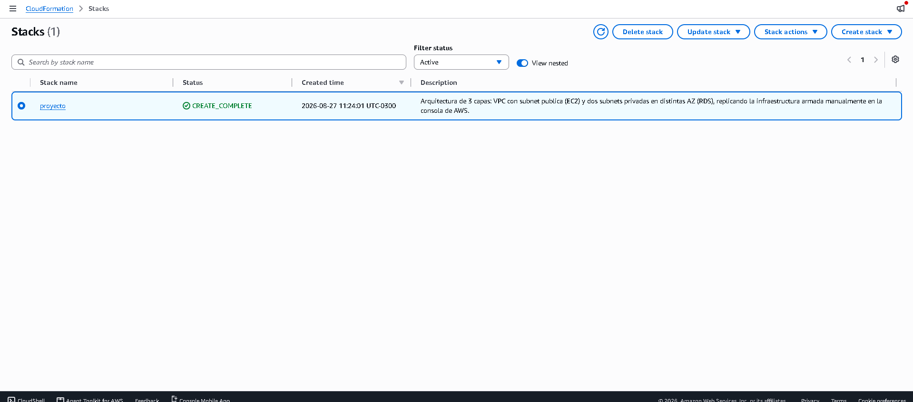
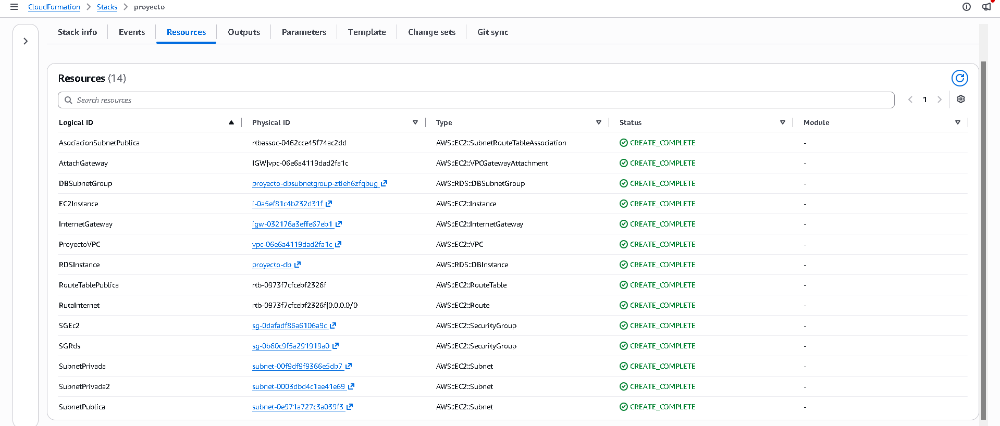

# Arquitectura de 3 capas en AWS con Infraestructura como Código

Proyecto personal para poner en práctica los conceptos de la certificación **AWS Certified Cloud Practitioner**: una arquitectura de 3 capas (web, aplicación y datos) desplegada primero manualmente en la consola de AWS, y luego replicada íntegramente como código con **AWS CloudFormation**.

## Arquitectura



*Vista generada por AWS mostrando la VPC, las 3 subnets distribuidas en distintas Availability Zones, las route tables y su conexión al Internet Gateway — solo la subnet pública está asociada a la ruta con salida a internet.*

**Capas:**
- **Capa de presentación/aplicación:** instancia EC2 en subnet pública, con un servidor web (Apache) sirviendo contenido.
- **Capa de datos:** instancia RDS (MySQL) en subnets privadas, sin acceso público, replicada en dos Availability Zones (requisito de AWS para el DB Subnet Group).
- **Red:** VPC dedicada con separación de subnets públicas/privadas, Internet Gateway y route tables configuradas explícitamente.

## Decisiones de diseño y seguridad

- **Segmentación pública/privada:** solo la subnet con la EC2 tiene ruta hacia el Internet Gateway (`0.0.0.0/0`). Las subnets de RDS no tienen salida a internet, lo que la hace inalcanzable desde afuera de la VPC.
- **Security Groups encadenados:** el Security Group de RDS (`sg-rds`) no permite tráfico desde ninguna IP — únicamente acepta conexiones que provengan del Security Group de la EC2 (`sg-ec2`). Esto garantiza que solo la capa de aplicación puede hablarle a la base de datos, sin importar desde dónde se conecte la EC2.

  

  *La regla de entrada del puerto 3306 tiene como Source el Security Group de la EC2, no una IP — RDS solo acepta conexiones que vengan de la capa de aplicación.*

- **`PubliclyAccessible: false` en RDS:** refuerza a nivel de configuración de RDS lo mismo que ya impone la red — la base nunca recibe una IP pública.
- **CIDR `/16` para la VPC y `/24` para subnets:** deja margen de crecimiento (65.536 IPs en la VPC, 256 por subnet) sin sobre-dimensionar, siguiendo la convención estándar de AWS.

## Cómo se construyó

1. **Fase manual (consola de AWS):** VPC, subnets, Internet Gateway, route tables, Security Groups, EC2 y RDS armados paso a paso desde la consola, para entender qué hace cada recurso y por qué.
2. **Fase de Infraestructura como Código:** toda la arquitectura fue traducida a una plantilla de **AWS CloudFormation** (`proyecto-3capas.yaml`), permitiendo desplegar y destruir el entorno completo de forma reproducible con un solo comando.

   

   

   *El stack crea automáticamente los 14 recursos de la arquitectura (VPC, subnets, security groups, EC2, RDS, route tables) con nombres lógicos que reflejan cada componente.*

## Stack técnico

- **AWS:** VPC, EC2, RDS (MySQL), Security Groups, Internet Gateway, Route Tables
- **Infraestructura como Código:** AWS CloudFormation (YAML)

## Cómo desplegarlo

### Requisitos previos
- Cuenta de AWS con permisos para crear los recursos listados
- Un key pair EC2 ya creado en la región donde vayas a desplegar
- AWS CLI configurada (opcional, también se puede desplegar desde la consola)

### Despliegue por CLI

```bash
aws cloudformation create-stack \
  --stack-name proyecto-3capas \
  --template-body file://proyecto-3capas.yaml \
  --parameters ParameterKey=KeyPairName,ParameterValue=tu-key \
               ParameterKey=MyIP,ParameterValue=TU.IP.PUBLICA/32 \
               ParameterKey=DBPassword,ParameterValue=TuPasswordSegura123
```

### Despliegue por consola

1. CloudFormation → Create stack → Upload a template file → seleccionar `proyecto-3capas.yaml`
2. Completar los parámetros (`KeyPairName`, `MyIP`, `DBUsername`, `DBPassword`, `DBName`)
3. Confirmar y esperar a que el stack quede en `CREATE_COMPLETE`

Los outputs del stack devuelven la IP pública de la EC2 y el endpoint de RDS.

### Destruir el entorno

```bash
aws cloudformation delete-stack --stack-name proyecto-3capas
```

Esto elimina todos los recursos creados (VPC, EC2, RDS, Security Groups, etc.) en el orden correcto.

## Qué aprendí

- Diseño y segmentación de una VPC con subnets públicas y privadas
- Configuración de Security Groups como mecanismo de control de acceso entre capas
- Diferencias prácticas entre configurar infraestructura manualmente y definirla como código
- Fundamentos de AWS CloudFormation: parámetros, recursos, dependencias (`DependsOn`) y outputs

## Autor

Joaquín Abreu — [LinkedIn](https://www.linkedin.com/in/joaquin-abreu-9a675b431/) · [GitHub](https://github.com/Joaquin-Abreu)
